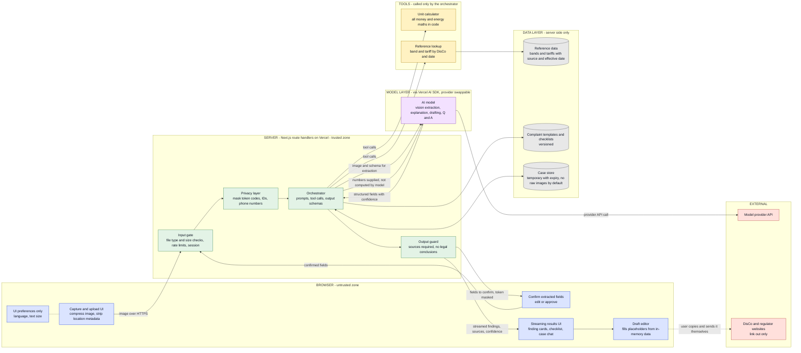
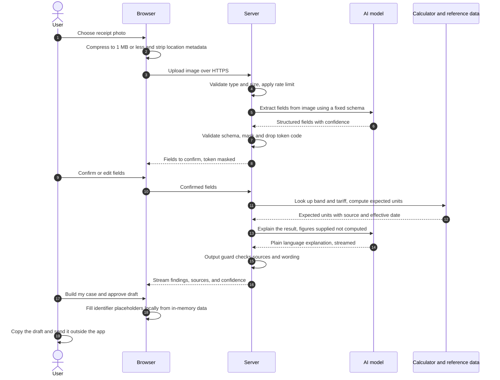

# Meterwise: System Boundary Diagram

**Version 0.1 · Phase 1a · 30 September 2026**

This is the core evidence for the Phase 1a outcome: it shows where every piece of Meterwise runs (browser, server, model, data, tools) **before any frontend code is written**, and where trust boundaries sit.

Related documents: [Product brief](01-product-brief.md) · [Risk register](03-risk-register.md) · [README](../README.md)

> GitHub renders the Mermaid diagrams below automatically. If you view this file somewhere that does not, paste each code block into [mermaid.live](https://mermaid.live).

---

## 1. Boundary diagram

Solid arrows are data flows. The dashed arrow is an action the user takes themselves, outside the app.

---

## 2. What runs where

| Piece | Runs in | Reason it lives there |
|---|---|---|
| Image capture, compression, location-metadata removal | **Browser** | Reduces upload size on poor connections and removes data before it leaves the device |
| Confirmation and edit forms for extracted fields | **Browser** | Human review gate (G1) |
| Streaming results, finding cards, evidence checklist, case chat UI | **Browser** | Presentation and interaction only |
| Draft editor and placeholder filling | **Browser** (in memory) | Identifiers are inserted locally so the model never needs to see the full values when drafting |
| UI preferences (language, text size, plain-language mode) | **Browser** storage | Non-sensitive |
| Upload validation, rate limiting, session handling | **Server** | Cannot be trusted to the client |
| Masking of token codes, IDs, and phone numbers | **Server** | Must happen before any text reaches the model or logs |
| Prompt assembly, tool orchestration, output schemas | **Server** | Keeps prompts and tool definitions private |
| Output guard (sources present, no legal conclusions, no accusations) | **Server** | Enforced independently of the model |
| Vision extraction, explanation, drafting, Q and A | **Model** | What the model is good at |
| Unit and cost calculations | **Tool (code)** | Deterministic and testable; the model never does arithmetic |
| Band and tariff lookup | **Tool + reference data** | Facts with a source and an effective date |
| Case store, templates, reference data | **Data layer** (server side) | Never delivered wholesale to the client |
| Sending a complaint | **User, outside the app** | Human control; the app never sends on the user's behalf |

---

## 3. Trust boundaries and what never crosses them

| Boundary | Never crosses it |
|---|---|
| **Browser to Server** | Nothing from the client is trusted without validation (file type, size, field ranges, schema) |
| **Server to Browser** | API keys, system prompts, tool definitions, other users' data, unmasked token codes, raw provider responses, internal logs |
| **Server to Model** | Unmasked identifiers beyond what extraction from the image requires, secrets, other users' data |
| **Model to Server** | Model output is treated as untrusted input: it is validated against a schema, checked for sources, and figures are compared with tool output |
| **Server to External** | Only masked or minimal data; no images stored by the provider integration by default |

---

## 4. Sequence: "Check my token"

---

## 5. Design rules this diagram enforces

1. **The browser never talks to the model provider.** Every model call goes through the server.
2. **The model never does arithmetic.** Numbers come from the calculator tool and are passed to the model to explain.
3. **Every factual claim about bands, tariffs, or procedures carries a source and an effective date**, or the product says it cannot confirm.
4. **Nothing leaves the app without the user approving it**, and the app never sends anything on their behalf.
5. **Sensitive identifiers are masked after extraction and are never persisted in the browser.**
6. **Provider-specific code lives in one server module**, so switching between Anthropic and OpenAI does not touch the UI.
