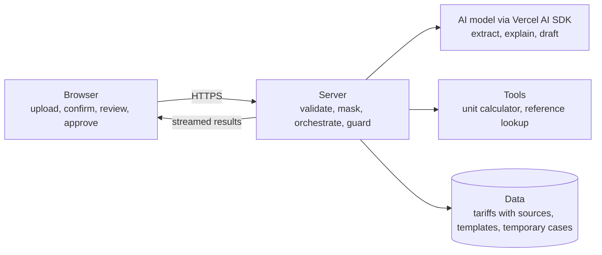

# Meterwise

**Understand what you were charged. Know what to do if it's wrong.**

Meterwise is an AI-native copilot for Nigerian electricity customers. Photograph a prepaid token receipt or a bill, confirm what was read, and get a sourced, plain-language check of the charges, plus guided next steps and a complaint draft you approve yourself.

- **Live site:** https://YOUR-PROJECT.vercel.app  <!-- replace after deploying to Vercel -->
- **Status:** Phase 1a (product strategy and frontend architecture). Planning build only: the live page is a placeholder and does not check real bills yet.
- **Track:** Flexisaf AI Native Frontend (Advanced)
- **Author:** Akanimo Umoh

## Phase 1a deliverables

| Deliverable | Where |
|---|---|
| Product brief | [docs/01-product-brief.md](docs/01-product-brief.md) |
| System boundary diagram | [docs/02-system-boundary-diagram.md](docs/02-system-boundary-diagram.md) |
| Risk register | [docs/03-risk-register.md](docs/03-risk-register.md) |
| README | This file |
| Live Vercel URL | See the link at the top of this file |

## The idea in 60 seconds

**Problem.** Electricity bills and prepaid token receipts are hard to verify, and the route to redress is unclear. Press coverage shows customers questioning whether units match payments, and regulators ordering refunds for billing errors. Existing tools cover outages, generic calculators, or static explainers; none I found reads your own receipt and guides you through evidence and complaint steps. (See the brief for sources and the caveats on that claim.)

**Solution.** A short guided flow:

1. Photograph a token receipt or bill.
2. Confirm what Meterwise read (nothing proceeds until you do).
3. See a plain-language check against the applicable band and tariff, with sources and dates.
4. If something does not match, get an evidence checklist and a complaint draft. You edit and approve it, and you send it yourself.

**What makes it AI-native.** Multimodal input, structured streamed output, human review gates, and a strict split of responsibilities: **the model reads and explains, code does the arithmetic, and reference data supplies the facts.**

## Architecture at a glance

The full annotated diagram, trust boundaries, and the "Check my token" sequence are in [docs/02-system-boundary-diagram.md](docs/02-system-boundary-diagram.md).



## Key decisions

- **AI platform:** built against Anthropic (Claude) through the Vercel AI SDK. **This is swappable:** the AI SDK keeps frontend code the same regardless of provider, so moving to OpenAI or another provider changes a provider package and configuration, not the UI. Provider-specific code will live in one server module, and the model identifier will come from an environment variable.
- **Framework:** Next.js (App Router), TypeScript, deployed on Vercel.
- **No arithmetic by the model.** All money and energy calculations run in a calculator tool.
- **Every factual claim carries a source and an effective date**, or the product says it cannot confirm.
- **Human in the loop:** extraction must be confirmed and drafts must be approved. The app never sends anything on the user's behalf.
- **Privacy by design:** no API keys or sensitive identifiers in the browser, token codes masked and never stored, manual entry as an alternative to uploading a photo.

## Tech stack

| Now (Phase 1a) | Planned |
|---|---|
| Next.js App Router, React, TypeScript | Vercel AI SDK with an Anthropic provider (OpenAI swappable) |
| Placeholder landing page | Route handlers for upload, extraction, analysis |
| Vercel deployment from GitHub | Calculator and reference lookup tools, case store, evaluation suite |

## Getting started

Requires Node.js 20.9 or newer.

```bash
npm install
npm run dev      # http://localhost:3000
npm run build    # production build check
```

No environment variables are needed yet. When model calls are added, secrets will be read from server-side environment variables only. Never prefix a secret so that it is exposed to the browser.

## Deploy to Vercel

1. Push this repository to GitHub.
2. Sign in to [vercel.com](https://vercel.com) with GitHub and choose **Add New, then Project**.
3. Import this repository. Vercel detects Next.js automatically, so leave the defaults.
4. Click **Deploy**. Every later push to the main branch deploys automatically.
5. Copy the production URL (for example `https://meterwise.vercel.app`) into the **Live site** line at the top of this README and push again.

## Repository layout

```
.
├── app/                      # Next.js App Router (placeholder landing page)
├── docs/
│   ├── 01-product-brief.md
│   ├── 02-system-boundary-diagram.md
│   └── 03-risk-register.md
├── next.config.ts
├── package.json
└── README.md
```

## Roadmap

| Phase | Focus | State |
|---|---|---|
| 1a | Product brief, boundary diagram, risk register, README, live URL | This submission |
| 1b | Codebase setup: structure, tooling, environment handling, pilot DisCo and sample receipts | Next |
| Later modules | Streaming, tool calling, generative UI, retrieval, accounts and persistence, evaluations and guardrails, observability | Planned extension points (see the brief) |

## Important notes

- Meterwise gives information, not legal advice.
- Items marked **[VERIFY]** in the brief come from press coverage or older regulatory documents and must be confirmed before being stated publicly.
- The "Meterwise" name, and the claim that no equivalent tool exists, still need to be checked (see the brief, section 17).
