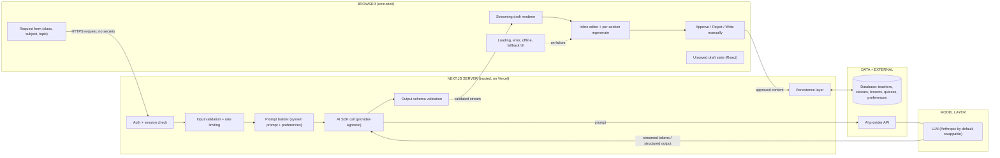
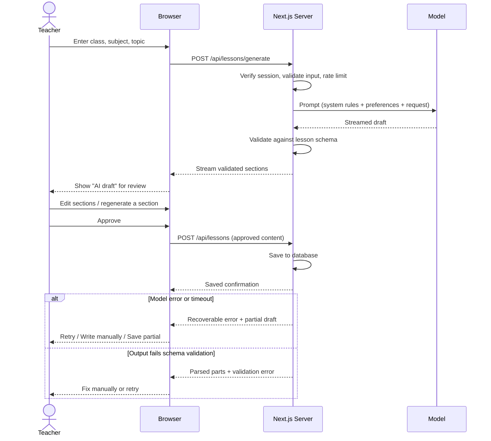
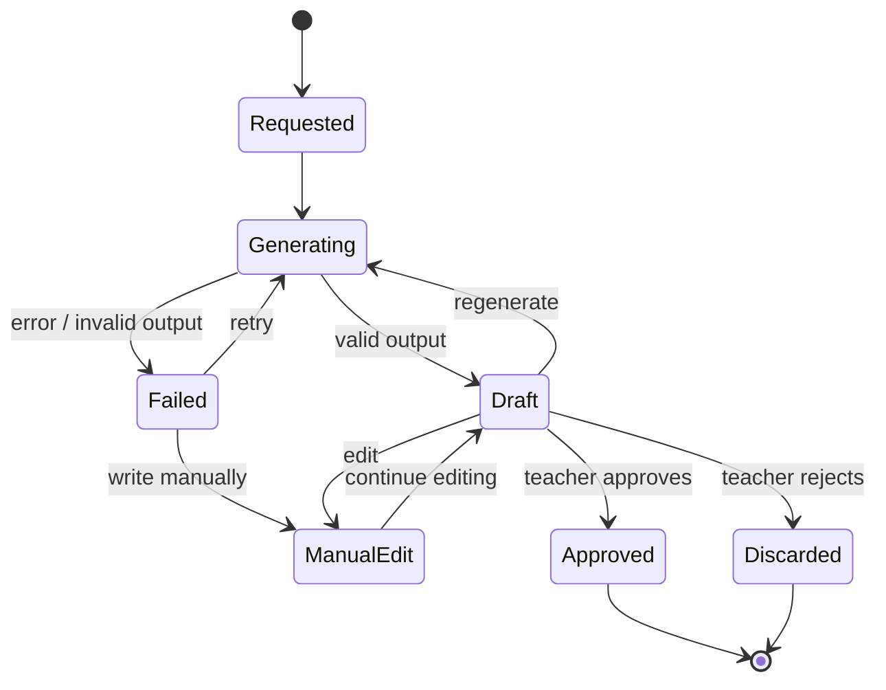

# TeachKit: System Boundary Diagram

This diagram shows what runs in the **browser**, the **server**, the **model** and **external services**, and what crosses each boundary. GitHub renders the Mermaid blocks below automatically.

## 1. System boundaries

### What crosses each boundary

| Boundary | Allowed to cross | Never crosses |
|---|---|---|
| Browser → Server | Teacher's request, edits, approve/reject actions | Nothing secret originates in the browser |
| Server → Browser | Validated, structured, teacher-scoped output; session cookie (HttpOnly) | API keys, system prompts, raw model responses, other teachers' data |
| Server → Model | Constructed prompt, teacher preferences, class level and topic | Student names or identifiers, credentials of the user |
| Model → Server | Streamed text / structured JSON | Nothing is trusted until validated |

## 2. Lesson generation sequence (happy path and fallbacks)

## 3. Approval loop (applies to lessons, quizzes and feedback)

Only the **Approved** state is written to the lesson/quiz library. Nothing moves from AI output to saved or shared content without the teacher's explicit action.